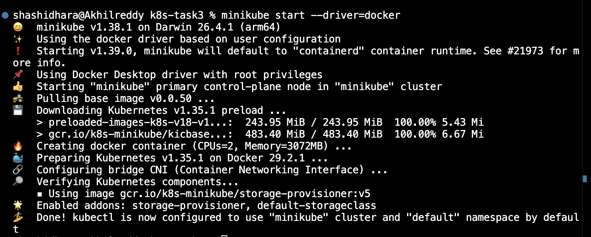
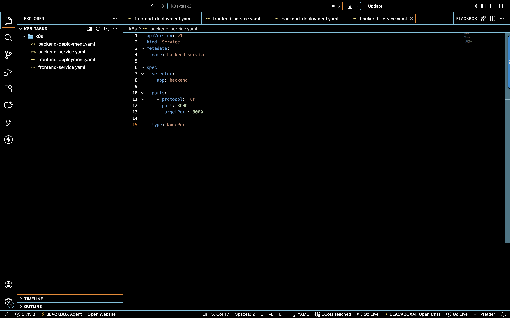
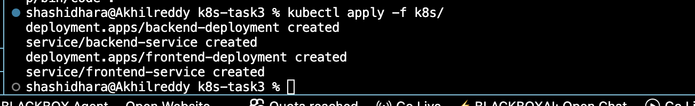
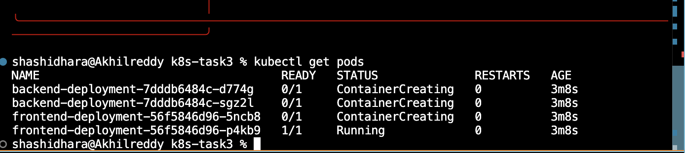
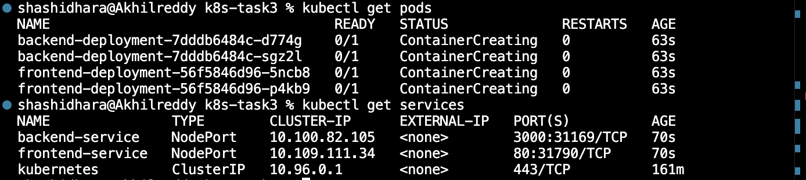
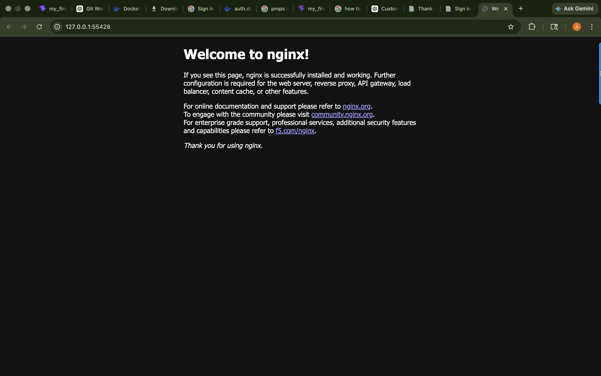
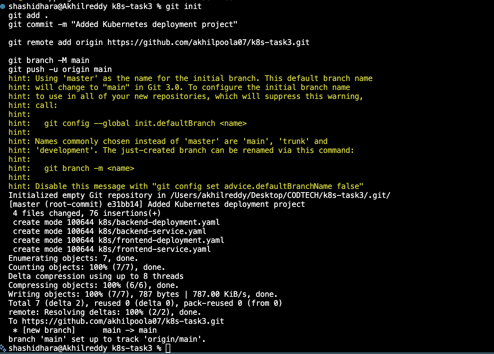

# 🚀 Kubernetes Microservices Deployment

## 📌 DevOps Internship - Task 3

This project demonstrates the deployment of a microservices-based application using Kubernetes and Minikube.

The application includes:
- Frontend Deployment
- Backend Deployment
- Kubernetes Services
- Pod Management
- Container Orchestration

---

# 📖 Project Objective

The main objective of this task is to:

✅ Deploy applications using Kubernetes  
✅ Manage deployments and services  
✅ Understand container orchestration  
✅ Work with Minikube local Kubernetes cluster  
✅ Learn Kubernetes YAML configurations  

---

# 🛠️ Technologies Used

| Technology | Purpose |
|------------|---------|
| Kubernetes | Container orchestration |
| Minikube | Local Kubernetes cluster |
| kubectl | Kubernetes command-line tool |
| Docker Desktop | Container runtime |
| YAML | Kubernetes configuration |
| Git & GitHub | Version control |

---

# 📂 Project Structure

```text
K8S-TASK3/
│
└── k8s/
    │
    ├── screenshots/
    │   ├── all-pods-running.png
    │   ├── frontend-running.png
    │   ├── github-push.png
    │   ├── minikube-success.png
    │   ├── pods-services-running.png
    │   ├── yaml-applied-success.png
    │   └── yaml-files-created.png
    │
    ├── backend-deployment.yaml
    ├── backend-service.yaml
    ├── frontend-deployment.yaml
    └── frontend-service.yaml
```

---

# ⚙️ Kubernetes Deployment Files

## Frontend Deployment

```yaml
apiVersion: apps/v1
kind: Deployment

metadata:
  name: frontend-deployment

spec:
  replicas: 2

  selector:
    matchLabels:
      app: frontend

  template:
    metadata:
      labels:
        app: frontend

    spec:
      containers:
      - name: frontend
        image: nginx:latest
        ports:
        - containerPort: 80
```

---

## Frontend Service

```yaml
apiVersion: v1
kind: Service

metadata:
  name: frontend-service

spec:
  selector:
    app: frontend

  ports:
    - protocol: TCP
      port: 80
      targetPort: 80

  type: NodePort
```

---

## Backend Deployment

```yaml
apiVersion: apps/v1
kind: Deployment

metadata:
  name: backend-deployment

spec:
  replicas: 2

  selector:
    matchLabels:
      app: backend

  template:
    metadata:
      labels:
        app: backend

    spec:
      containers:
      - name: backend
        image: node
        ports:
        - containerPort: 3000
```

---

## Backend Service

```yaml
apiVersion: v1
kind: Service

metadata:
  name: backend-service

spec:
  selector:
    app: backend

  ports:
    - protocol: TCP
      port: 3000
      targetPort: 3000

  type: NodePort
```

---

# 🚀 Commands Used

## Start Minikube

```bash
minikube start --driver=docker
```

---

## Apply Kubernetes YAML Files

```bash
kubectl apply -f k8s/
```

---

## Check Pods

```bash
kubectl get pods
```

---

## Check Services

```bash
kubectl get services
```

---

## Open Application

```bash
minikube service frontend-service
```

---

# 📸 Screenshots

## Minikube Started Successfully



---

## YAML Files Created



---

## YAML Applied Successfully



---

## All Pods Running



---

## Pods & Services Running



---

## Frontend Application Running



---

## GitHub Push Successful



---

# 🔥 Features

✅ Kubernetes Deployments  
✅ Kubernetes Services  
✅ Multiple Replica Management  
✅ Pod Management  
✅ NodePort Service Exposure  
✅ Container Orchestration  
✅ Minikube Local Cluster  

---

# 📚 Learning Outcomes

Through this project, I learned:

- Kubernetes fundamentals
- Deployments and Services
- Pod management
- YAML configuration files
- Minikube setup
- Container orchestration concepts
- kubectl commands

---

# 👨‍💻 Author

## Poola Akhil

- GitHub: https://github.com/akhilpoola07
- LinkedIn: https://www.linkedin.com/in/akhilpoola07

DevOps Internship Task Submission

---

# ⭐ Conclusion

This project demonstrates the successful deployment of a microservices-based application using Kubernetes and Minikube.

The deployment includes scalable pods, services, and orchestration concepts used in modern DevOps workflows.

---
